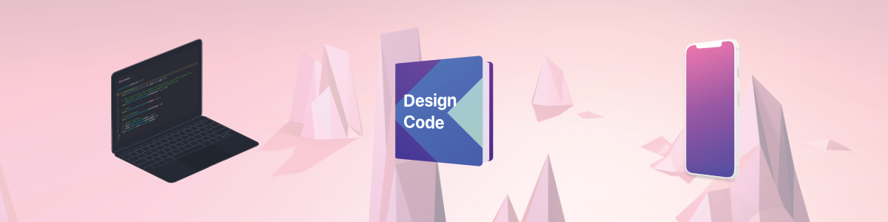

## :question: About
iOS Project focused on UI and UX design based on [Design+Code](https://designcode.io)

## :blue_book: Chapter 1 (12 Sections)
- [X] Learning iOS 11 Design
- [X] Designing for iPhone X
- [ ] Design for iPad
- [ ] Design for Apple Watch
- [X] Learn Colors
- [X] Learn Typography
- [X] Learn Animations
- [X] UI Icons
- [X] UI Sounds
- [X] Design Inspiration
- [X] Design Principles
- [X] Launching Your Product

## :blue_book: Chapter 2 (21 Sections)
- [ ] Learn Sketch
- [ ] Powerful Start in Sketch
- [ ] Design for iOS 11
- [ ] Design for iPhone X
- [ ] Design for iPad
- [ ] Design for Web
- [ ] Design for Web (Part 2)
- [ ] Tricks and Shortcuts
- [ ] Sketch Plugins
- [ ] Nested Symbols
- [ ] Sketch Libraries
- [ ] Version Control
- [ ] Working with Data
- [ ] Adaptive Layouts
- [ ] Working with Vector
- [ ] Exporting Assets
- [ ] Styleguide and Handoff
- [ ] Previewing and Sharing
- [ ] Advanced Techniques
- [ ] Intro to Framer
- [ ] Prototyping in Keynote

## :blue_book: Chapter 3 (19 Sections)
- [ ] Learn Swift 4
- [ ] Intro to Xcode 9
- [ ] Intro to Storyboard
- [ ] Prototyping in Xcode
- [ ] Swift Playground
- [ ] Design in Playground
- [ ] Animate in Playground
- [ ] Design in Storyboard
- [ ] Auto Layout
- [ ] Adapting for iPhone X
- [ ] Storyboard and Code
- [ ] Parallax Animation
- [ ] Collection View
- [ ] Static Data
- [ ] 3D Animation
- [ ] Container View
- [ ] Passing Data
- [ ] Status Bar
- [ ] Storyboard in Playground

## :blue_book: Chapter 4 (22 Sections)
- [ ] Tab Bar
- [ ] Navigation Bar
- [ ] Table View Controller
- [ ] Web View Controller
- [ ] Default Transitions
- [ ] Custom Transitions
- [ ] Gesture Interactions
- [ ] CocoaPods
- [ ] Keyboard Interactions
- [ ] Progress Rings
- [ ] Delegation
- [ ] Multiple Storyboards
- [ ] Dynamic Type
- [ ] Implement Dark Mode
- [ ] JSON Parsing
- [ ] Core Data
- [ ] Realm
- [ ] Networking
- [ ] Implementing Search
- [ ] Posting and Storing Data
- [ ] TestFlight
- [ ] Publish to the App Store
